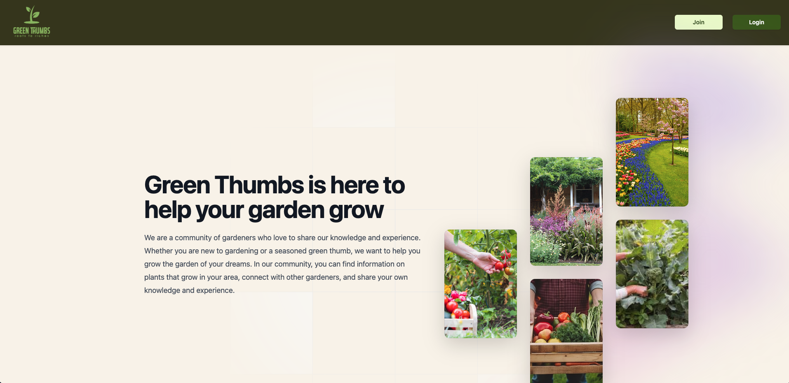
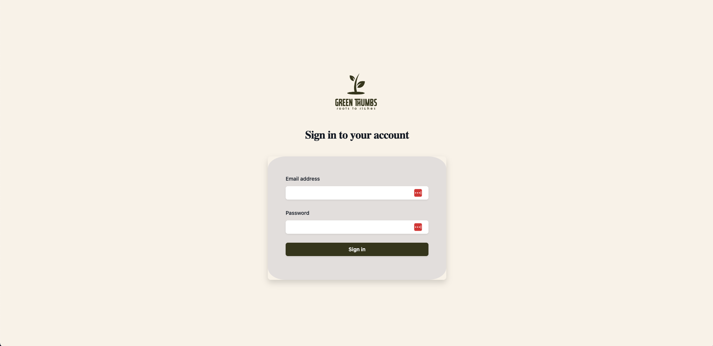
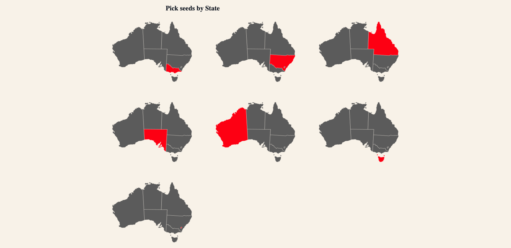

# Green Thumbs
A website to learn about gardening and talk to your fellow Australians for best gardening practice! 

## Description

Green Thumbs is Australia's leading gardening community. Whether you're new in the garden or a seasoned veteran, our community is the place to share knowledge and find out what to plant next. 

This project was motivated by the all-too-common experience of walking out into the garden and seeing the your plants wilting or being eaten away by bugs. 

We wanted to crowdsource the knowledge of thousands of gardeners from across Australia and find out the best things to grow, at what time of year, and the tips to help them flourish. 

## Table of Contents 

- [Green Thumbs](#green-thumbs)
  - [Description](#description)
  - [Table of Contents](#table-of-contents)
  - [Installation](#installation)
  - [Usage](#usage)
  - [Credits](#credits)
  - [License](#license)

## Installation

As a developer, to install the program, developers should follow the following steps:
1. Download the code repository from GitHub: https://github.com/NuclearReid/Green-Thumbs.
2. Open an integrated terminal and install the required packages (for example, using: npm install).
3. Initialise mySQL and source the db/schema.sql file.
4. Run npm start on your integrated terminal.

If successful, the program should then run in your local environment (for example: http://localhost:3001/).

## Usage

As a user, the website can be accessed on any web browser at the following URL: [Green Thumbs](https://afternoon-shore-14413-3943e17402c9.herokuapp.com/)

When you land on the homepage, you will see this page:

As a new user, you will need to sign up with an email and password. 

Once you have signed up, you can log in with those credentials via the log in page:

On the main site, users can navigate to their relevant location in Australia by selecting their state. That way they will recieve information relevant to their location and be able to ask questions to local gardeners who are familiar with their local climate. 

## Credits

This project has been the work of four main collaborators
[Reid](NuclearReid),
[Yousra](https://github.com/Yousra-Kamal),
[Stacey](https://github.com/Staceka1) and
[Alec](https://github.com/a-r3n). 

It has also only been possible due to a number of third-party assets, libraries and technologies, including Node.js, Express, mySQL, Slick.

Thank you to all the people that have worked on these projects. 

## License

This project has been developed under a MIT License. 

For more information on the license and its conditions of use, refer to the license document in the GitHub repository.
